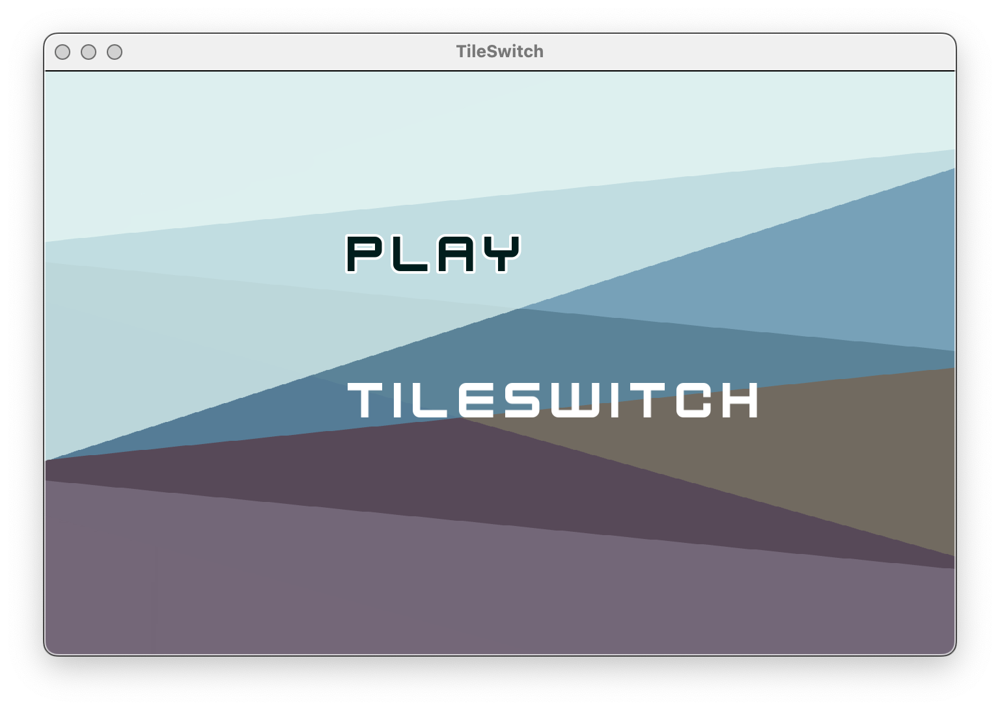
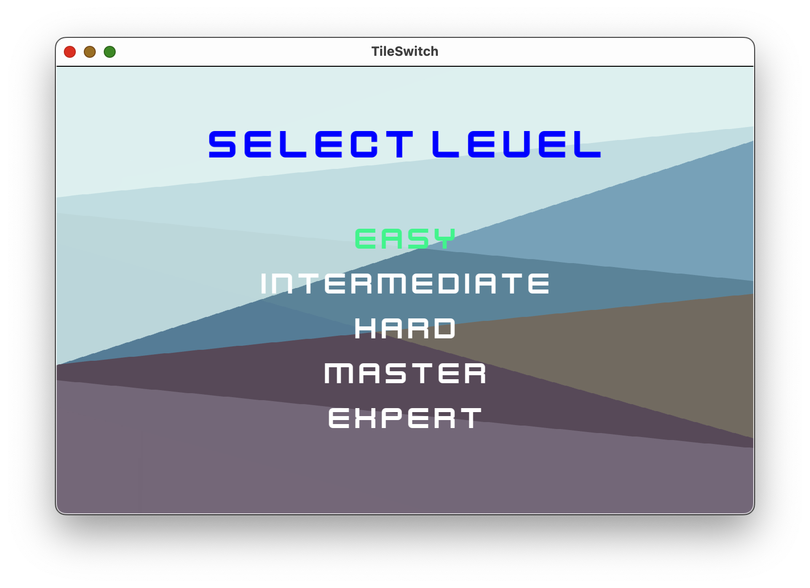
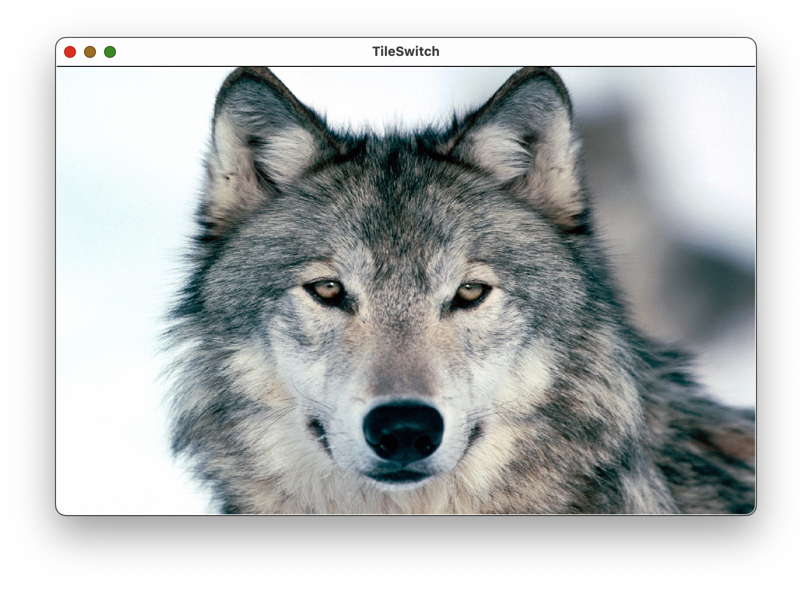
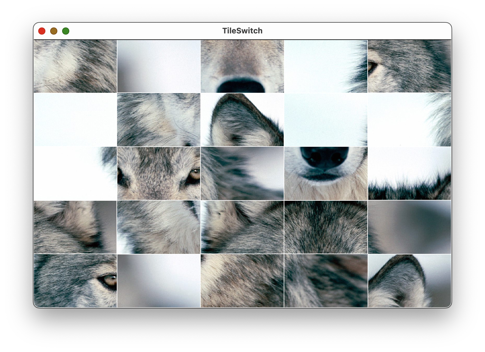

# TileSwitch
Interactive tile switch puzzle game made in C++ using SFML.

## Setup
Make sure sfml is installed:

    brew install sfml

## Run Program
From TileSwitch/TileSwitch, run:

    g++ -Wall -std=c++11 *.cpp -Iinclude -I/opt/homebrew/include -L/opt/homebrew/lib -lsfml-audio -lsfml-graphics -lsfml-window -lsfml-system -o game

Then:

    ./game

## How to Play

Select level:

Memorize image:

Put scrambled image to original:

